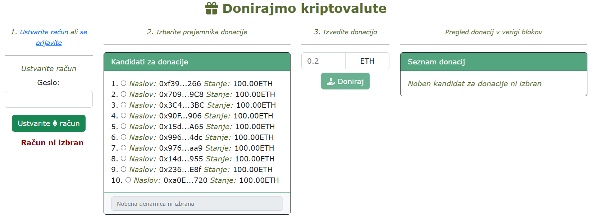
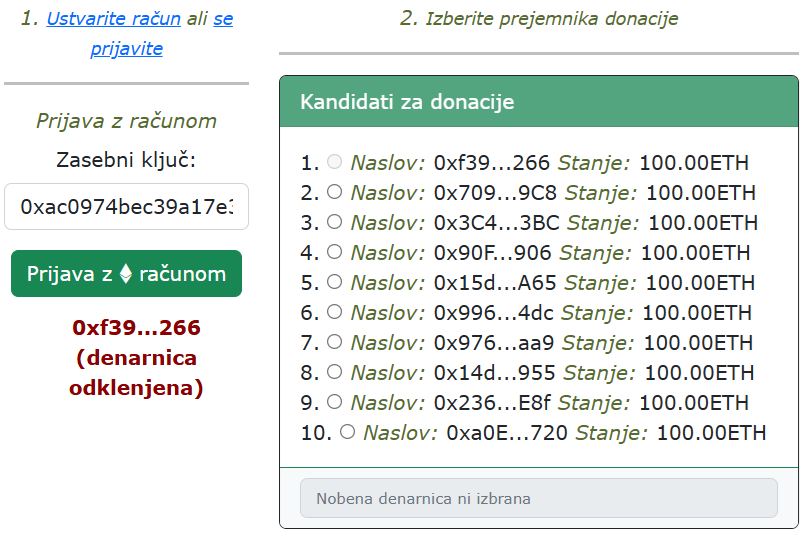
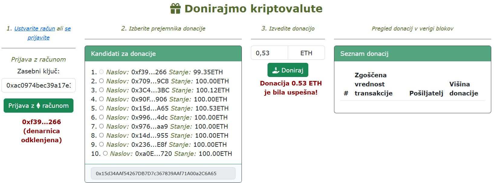
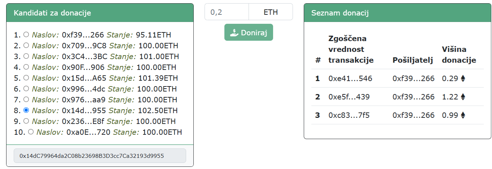

# **V12** uvod v tehnologijo veriženja blokov

Odgovore na vprašanja iz teh vaj lahko posredujete v okviru [ lekcije **V12**](https://ucilnica.fri.uni-lj.si/mod/quiz/view.php?id=58822) na spletni učilnici.

## Vzpostavitev okolja in opis

Na voljo je odjemalska spletna **decentralizirana aplikacija** (angl. decentralized application, dApp) za izvajanje **donacij kriptovalut**.. V okviru vaj popravite in dopolnite obstoječo implementacijo v datoteki `js/skripta.js`, kot zahtevajo navodila. Med delom smiselno uveljavljajte spremembe v lokalnem in oddaljenem repozitoriju!

Pri reševanju vseh nadaljnjih nalog si pomagajte s to dokumentacijo knjižnice [ **ethers** ](https://docs.ethers.org/v6/) različico _6.x_.

## Dostop do verige blokov in računi

V okviru tega predmeta in posledično vaj bomo uporabljali lastno privatno verigo blokov, ki jo bomo lokalno zagnali ter dostopali. Razvojno okolje [ **Hardhat**](https://hardhat.org/) omogoča enostavni zagon lastne privatne verige blokov Ethereum. Uporabimo jo lahko za izvajanje testov, ukazov in pregleda stanja ter nam tudi omogoča nadzor nad delovanjem verige blokov. Za vzpostavitev Ethereum lokalne verige blokov izvedemo naslednje korake:
1. V korenskem imeniku vaj ustvarimo novo mapo dapp (z ukazom `mkdir dapp`) in se vanjo premaknemo (ukaz `cd dapps`).
2. Nato namestimo _Hardhat_ s pomočjo naslednjega ukaza:
    ~~~ {.bash}
    npm install -g hardhat
    ~~~
3. Nato lahko preverimo ali je bila namestitev uspešna in katera verzija je nameščena (primer odgovora `2.24.0`):
    ~~~ {.bash}
    hardhat --version
    ~~~
4. Nato v naši prazni mapi `dapp` inicializiramo _Hardhat_ projekt s privzetimi nastavitvami (npr. `Create a JavaScript project`, v privzeti mapi `dapp`, z dodano datoteko `.gitignore` in vzorčni projekt), ki ga izvedemo z naslednjim ukazom:
    ~~~ {.bash}
    hardhat init 
    ~~~
   Ustvarijo se mape za različne namene (npr. Solidity pametnimi pogodbami, ki jih v okviru predmeta ne bomo obravnavali, konfiguracije, testi, idr.).
5. V datoteko `dapp/hardhat.config.js` dodamo še osnovne nastavitve računov in sicer _10 računov_, ki imajo privzeto _100 ETH_ sredstev:
    ~~~~ {.javascript}
    require("@nomicfoundation/hardhat-toolbox");
    
    /** @type import('hardhat/config').HardhatUserConfig */
    module.exports = {
        solidity: "0.8.28",
        networks: {
            hardhat: {
                accounts: {
                    count: 10,
                    accountsBalance: "100000000000000000000",
                }
            },
            localhost: {
                url: "http://127.0.0.1:8545",
            }
        }
    };
    ~~~~
6. Lokalno vozlišče zaženemo z naslednjim ukazom v ukazni vrstici:
    ~~~ {.bash}
    npx hardhat node
    ~~~

Uspešno zagnano lokalno vozlišče je dostopno preko URL naslova .

Primer izpisa uspešno zagnane lokalne privatne verige blokov, kjer so na voljo naslednje osnovne informacije:
* URL naslov **[http://127.0.0.1:8545](http://127.0.0.1:8545)** za interakcijo z verigo blokov,
* 10 računov s privzetimi sredstvi (`100 ETH`) z naslovi denarnic oz. javni ključi in
* zasebni ključi za dostop do denarnic na podlagi mnemonskega stavka iz 12 besed `test test test test test test test test test test test junk`.

~~~~ {.bash}
npm warn Unknown user config "msvs_version". This will stop working in the next major version of npm.
Started HTTP and WebSocket JSON-RPC server at http://127.0.0.1:8545/

Accounts
========

WARNING: These accounts, and their private keys, are publicly known.
Any funds sent to them on Mainnet or any other live network WILL BE LOST.

Account #0: 0xf39Fd6e51aad88F6F4ce6aB8827279cffFb92266 (100 ETH)
Private Key: 0xac0974bec39a17e36ba4a6b4d238ff944bacb478cbed5efcae784d7bf4f2ff80

Account #1: 0x70997970C51812dc3A010C7d01b50e0d17dc79C8 (100 ETH)
Private Key: 0x59c6995e998f97a5a0044966f0945389dc9e86dae88c7a8412f4603b6b78690d

Account #2: 0x3C44CdDdB6a900fa2b585dd299e03d12FA4293BC (100 ETH)
Private Key: 0x5de4111afa1a4b94908f83103eb1f1706367c2e68ca870fc3fb9a804cdab365a

Account #3: 0x90F79bf6EB2c4f870365E785982E1f101E93b906 (100 ETH)
Private Key: 0x7c852118294e51e653712a81e05800f419141751be58f605c371e15141b007a6

Account #4: 0x15d34AAf54267DB7D7c367839AAf71A00a2C6A65 (100 ETH)
Private Key: 0x47e179ec197488593b187f80a00eb0da91f1b9d0b13f8733639f19c30a34926a

Account #5: 0x9965507D1a55bcC2695C58ba16FB37d819B0A4dc (100 ETH)
Private Key: 0x8b3a350cf5c34c9194ca85829a2df0ec3153be0318b5e2d3348e872092edffba

Account #6: 0x976EA74026E726554dB657fA54763abd0C3a0aa9 (100 ETH)
Private Key: 0x92db14e403b83dfe3df233f83dfa3a0d7096f21ca9b0d6d6b8d88b2b4ec1564e

Account #7: 0x14dC79964da2C08b23698B3D3cc7Ca32193d9955 (100 ETH)
Private Key: 0x4bbbf85ce3377467afe5d46f804f221813b2bb87f24d81f60f1fcdbf7cbf4356

Account #8: 0x23618e81E3f5cdF7f54C3d65f7FBc0aBf5B21E8f (100 ETH)
Private Key: 0xdbda1821b80551c9d65939329250298aa3472ba22feea921c0cf5d620ea67b97

Account #9: 0xa0Ee7A142d267C1f36714E4a8F75612F20a79720 (100 ETH)
Private Key: 0x2a871d0798f97d79848a013d4936a73bf4cc922c825d33c1cf7073dff6d409c6

WARNING: These accounts, and their private keys, are publicly known.
Any funds sent to them on Mainnet or any other live network WILL BE LOST.
~~~~

## Naloge

Zagon aplikacije izvedete tako, da odprite spletno stran `index.html` in pojaviti bi se vam moralo okno, prikazano na naslednji sliki.

   
    <i>Uporabniški vmesnik spletne aplikacije za donacije kriptovalut</i>

Po uspešnem zagonu lokalne privatne verige blokov se osredotočimo na implementacijo funkcionalnosti tehnologije veriženja blokov Ethereum omrežja. Za interakcijo z verigo blokov bomo uporabili knjižnico [ **ethers** ](https://docs.ethers.org/v6/) različico _6.x_.

> **Opomba**: Za poenostavljeno reševanje naloge so v programski kodi v datoteki `js/skripta.js` na mestih kjer se zahtevajo odgovori podani nizi **`ODGOVOR`** kar posledično na spletni strani prikazuje napake na strani odjemalca. **Nize `ODGOVOR` nadomestite s pravilnimi odgovori oz. rešitvami.**

### 1. Prijava uporabnika v račun in ustvarjanje računa

Za pošiljanje sredstev iz računa je potrebno najprej v celoti podpreti 1. korak aplikacije (_1. Ustvarite račun ali se prijavite_) in sicer:
* dostop oz. prijavo obstoječega računa (oz. denarnice) ter
* ustvarjanje novega računa.

Delovanje prijave je z uporabo `ethers` knjižnice malenkost drugačno od običajne prijave, kjer kot enolični identifikator prijave (npr. elektronski naslov, unikatno uporabniško ime, davčna številka, vpisna številka itd.). Tega podatka ni potrebno navesti, v našem primeru pa ro predstavlja **naslov** našega Ethereum računa, ki se začne z znakoma `0x`, je dolžine **42 znakov**, kjer so preostali znaki črke angleške abecede in števila (npr. `0xf39Fd6e51aad88F6F4ce6aB8827279cffFb92266`). Zasebni ključi imajo dolžino **64 znakov** in so edini podatek, ki ga je potrebno navesti pri prijavi obstoječega računa oz. denarnice.

Pri ustvarjanju računa ni potrebno navesti nobenega vhodnega podatka pri čemer se generira nov naslov denarnice (javni ključ) in zasebno geslo za dostop (zasebni ključ).

Pri prijavi je treba ustrezno uporabiti _ethers_ konstruktor [`new Wallet`](https://docs.ethers.org/v6/api/wallet/#Wallet_new).

Pri generiranju novega naslova denarnice je treba ustrezno uporabiti _ethers_ funkcijo [`createRandom`](https://docs.ethers.org/v6/api/wallet/#Wallet_createRandom).

> **Namig**: Čas trajanja prijave je z uporabo _ethers_ knjižnice **časovno neomejen** v trenutni seji odjemalca.

   
    <i>Primer uspešne prijave s prvim računom.</i>

### 2. Izvajanje transakcij

Po uspešni prijavi v 2. koraku aplikacije (_2. Izberite prejemnika donacije_) izberemo naslov donacije iz seznama kandidatov za donacije pri čemer ni mogoče izvajati "samodonacije".

Implementirajte izvajanje transakcije prijavljenih uporabnikov. Funkcionalnost naj bo na voljo ob kliku na gumb **Doniraj**, kjer je treba uporabiti _ethers_ funkcijo [`sendTransaction`](https://docs.ethers.org/v6/api/providers/#Signer-sendTransaction) pri čemer moramo najprej izbrati prijavljeno denarnico z uporabo _ethers_ funkcije [`getSigner`](https://docs.ethers.org/v6/api/providers/#BrowserProvider-getSigner) (glej naslednjo sliko).

Enostavno transakcijo je mogoče izvesti s sledečima parametra vmesnika [TransactionRequest](https://docs.ethers.org/v6/api/providers/#TransactionRequest):

* prejemnik (parameter `to`) in
* količina (parameter `value`).

Vsaka _Ethereum_ (ETH) enota (1 ETH) je na verigi blokov deljiva na 18 decimalnih mest, kjer so enote v predstavljene v celoštevilski obliki. Zato je potrebno vsako enoto množiti s 1018, npr. `1 * Math.pow(10, 18)`. Pretvorbo bomo izvedli povsem ročno pri čemer bodite pozorni na to, da parameter `value` sprejme podatek v [`BigInt`](https://docs.ethers.org/v6/migrating/#migrate-bigint) podatkovnemu tipu, zato ga ustrezno pretvorite iz niza.

Kljub generirani zgoščeni vrednosti (angl. hash) transakcije bodite pozorni, da vedno pokličete še `ethers` funkcijo [`wait`](https://docs.ethers.org/v6/api/providers/#TransactionResponse-wait), da se nov blok s traksakcijo tudi generira.

   
    <i>Prikaza donacije 0,53 ETH sredstev.</i>

### 3. Pregled transakcij

Trenutna rešitev omogoča ob kliku na izbranega prejemnika donacije (2. korak aplikacije) prikaz števila donacij (transakcij). Najprej je potrebno preberiti število vseh blokov z uporabo _ethers_ funkcije [`getBlockNumber`](https://docs.ethers.org/v6/api/providers/#Provider-getBlockNumber) ter vsebine posameznega bloka z uporabo _ethers_ funkcije [`getBlock`](https://docs.ethers.org/v6/api/providers/#Provider-getBlock). Dopolnite implementacijo, da se bodo izpisovali podatki o pošiljatelju, prejemniku in količini donacije, ki jih pridobite z uporabo _ethers_ funkcije [`getTransaction`](https://docs.ethers.org/v6/api/providers/#Block-getTransaction). Bodite pozorni, da pri prikazu vrednosti transakcije uporabite funkcijo [`formatEther`](https://docs.ethers.org/v6/api/utils/#formatEther), ki prebrano vrednost v najmanjšo enoto **Wei (1018)** pretvori v **Ether enoto**. Omejite tudi prikaz donacij tako, da bodo razvidne le tiste donacije, ki vsebujejo izbran račun za donacije v 2. koraku kot prejemnika sredstev transakcije (glej naslednjo sliko).

   
    <i>Primer prikaza donacij računa izbranega v 2. koraku aplikacije</i>

