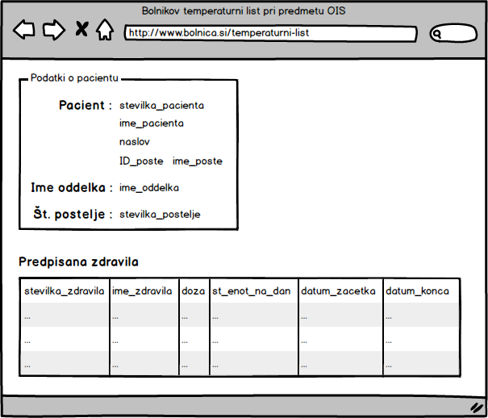
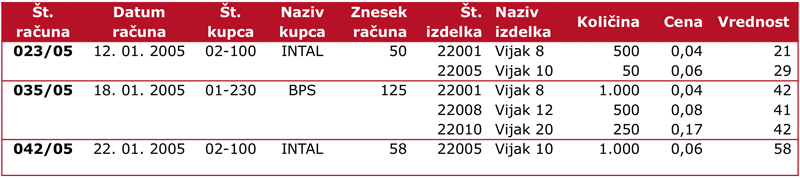

# **V8** Normalizacija

Za lažje razumevanje vaj si poglejte predavanja P8 [Strukturni razvoj](https://teaching.lavbic.net/OIS/2024-2025/P8.html), odgovore na vprašanja iz teh vaj lahko posredujete v okviru [lekcije **V8**](https://ucilnica.fri.uni-lj.si/mod/quiz/view.php?id=58634) na spletni učilnici.

## Opis problema

Kot obetajoči študent Fakultete za računalništvo in informatiko se znajdete v **vlogi analitika** in **načrtovalca** manjših delov dveh informacijskih sistemov, ki podpirata **delovanje bolnišnice** in **predstavitev podatkov o računih**. V obeh primerih boste morali poskrbeti za ustrezno strukturo podatkov v podatkovni bazi in sicer:
1. V okviru **normalizacije temperaturnega lista bolnika** boste morali poskrbeti za ustrezno strukturo podatkov v podatkovni bazi v zvezi z zdravili, ki jih pacientu predpiše zdravnik.
2. V okviru **normalizacije računov** boste morali poskrbeti za ustrezno strukturo podatkov v podatkovni bazi v zvezi z računi pridobljenimi iz "flat file" oblike tabele.

## Normalizacija temperaturnega lista bolnika

### Navodila

Že pred časom ste se z vodstvom bolnišnice pogovarjali o različnih načinih zapisa podatkov v podatkovni bazi za **bolnikov temperaturni list** (t.j. navodila za jemanje zdravil, ki jih bolniku predpiše zdravnik).

Prišli ste do zaključka, da bo za omenjen problem najbolj primerna 3. normalna oblika (3. NO). Zdaj je potrebno upoštevati vse pridobljene podatke in pripraviti **načrt podatkovne baze v obliki relacij** in **logično shemo podatkovne baze**.

   
    <i>Predloga uporabniškega vmesnika bolnikovega temperaturnega lista</i>

Pri pripravi načrta podatkovne baze, poleg **predloge uporabniškega vmesnika** na zgornji sliki, upoštevajte tudi naslednje zahteve:

* pacient lahko v nekem obdobju vzame več zdravil, prav tako lahko vzame isto zdravilo večkrat v različnih obdobjih,
* število enot zdravila na dan (`stevilo_enot_na_dan`) in datum konca jemanja zdravila (`datum_konca`) sta odvisna od dogodka predpisanega jemanja zdravil,
* veljajo pa tudi naslednje funkcionalne odvisnosti:
    * `stevilka_zdravila` &rarr; `opis`
    * `stevilka_pacienta` &rarr; `stevilka_postelje`
    * `stevilka_zdravila` &rarr; `ime_zdravila`
    * `stevilka_pacienta` &rarr; `ID_poste`
    * `stevilka_postelje` &rarr; `stevilka_oddelka`
    * `ID_poste` &rarr; `ime_poste`
    * `stevilka_oddelka` &rarr; `ime_oddelka`
    * `stevilka_kategorije` &rarr; `naziv_kategorije`
    * `stevilka_pacienta` &rarr; `naslov`
    * `stevilka_pacienta` &rarr; `ime_poste`
    * `stevilka_zdravila` &rarr; `doza`
    * `stevilka_zdravila` &rarr; `metoda_zauzitja`
    * `stevilka_pacienta` &rarr; `ime_pacienta`
    * `stevilka_zdravila` &rarr; `stevilka_kategorije`
    * `stevilka_zdravila` &rarr; `naziv_kategorije`
    * `stevilka_pacienta` &rarr; `ime_oddelka`
    * `stevilka_kategorije` &rarr; `metoda_zauzitja`

### Naloga

Pripravite **normalizirano shemo** predstavljenega problema v **3. NO** in jo zapišite v obliki **relacij** in **diagrama z medsebojnimi povezavami**.

## Normalizacija računov

### Navodila

Navodila v nadaljevanju so povzeta s [skripte predavanj](https://teaching.lavbic.net/OIS/2024-2025/P8.html#normalizacija-ra%C4%8Duna).

Na podlagi podatkov iz “flat file” oblike spodnje slike nam **tabela predstavlja podatke o računih** (ki ne ustrezajo pogojem za relacijo).

   
    <i>Primer računa</i>

### Naloga

Pripravite **normalizirano shemo** predstavljenega problema v **3. NO** in jo zapišite v obliki **relacij** in **diagrama z medsebojnimi povezavami**.