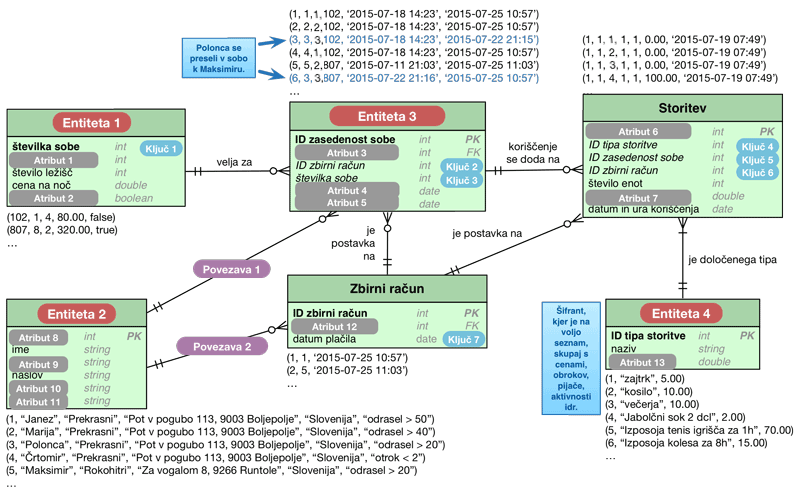

# **V7** Entitetno-relacijsko načrtovanje

Za lažje razumevanje vaj si poglejte predavanja P8 [Strukturni razvoj](https://teaching.lavbic.net/OIS/2024-2025/P8.html), odgovore na vprašanja iz teh vaj lahko posredujete v okviru [lekcije **V7**](https://ucilnica.fri.uni-lj.si/mod/quiz/view.php?id=58633) na spletni učilnici.

## Opis problema

Kot obetajoči študent Fakultete za računalništvo in informatiko se znajdete v **vlogi analitika** in **načrtovalca** manjših delov dveh informacijskih sistemov.

Za vas sta pripravljena dva problema, ki se ukvarjata s **pripravo načrta podatkovnega modela** na dveh različnih domenah in sicer **fakultete** in **hotela**.

## Priprava osnovnega načrta podatkovnega modela fakultete

### Navodila

Na razgovoru za službo želi potenticalni bodoči delodajalec ugotoviti ali razumete (entitetno-relacijsko) ER načrtovanje. Ker ste še študenti, boste delali na pedagoški domeni in sicer osnovni **pedagoški proces** na fakulteti. Zaposlenemu v podjetju je zmanjkalo časa za dokončanje ER modela, zato ga morate dopolniti na podlagi sledečega opisa.

Fakulteto obiskujejo **študenti**, ki lahko poslušajo predmete. Za vsakega študenta se pri vpisu, poleg datuma vpisa, dodeli še ostale osnovne podatke in sicer unikatno vpisno številko, ime, priimek in študentski elektronski naslov. Vsak **predmet** ima opredeljeno enolično šifro predmeta, naziv predmeta in program na kateremu se predmet primarno izvaja. Poleg tega so predmeti ovrednoteni s kreditnimi točkami in se izvajajo v določenem letniku študijskega programa ter prvemu (zimskemu) ali drugemu (poletnemu) semestru. Predmeti se izvajajo v različnih **prostorih** fakultete. Vsak prostor ima svoje ime (npr. predavalnica PR01, laboratorij PR09 idr.), število delovnih mest in se izvajajo ob točno določenih terminih opredeljeni z začetkom ter koncem izvajanja. Predmet izvaja vsaj en, običajno pa več **pedagogov predmeta**, kjer ima pedagog določeno funkcijo, pri čemer ima predmet natanko enega nosilca. **Pedagog** je opredeljen z osnovnimi podatki imenom ter priimkom, funkcija pa s trenutno izvolitvijo v habilitacijo, ki se jo obnavlja na 3 do 5 let. **Habilitacija** je opredeljena s stopnjo izobrazbe (1. za nedokončano osnovno šolo do 8. doktorat znanosti) in nazivom (npr. asistent, docent idr.).

### Naloga

Dopolnite načrt podatkovnega modela na naslednji sliki in sicer:
* _Entitete 1&#8211;3_,
* _Ključe 1&#8211;6_,
* _Atribute 1&#8211;8_ in
* _Povezavi 1&#8211;2_.

    
    <i>Podatkovni model fakultete z manjkajočimi elementi</i>

## Priprava načrta podatkovnega modela hotela

### Navodila

V manjšem obmorskem kraju ima lastnik manjšega hotela željo ugotoviti, da ste vešči računalništva, ker ste poslušali predmet Osnove informacijskih sistemov. V svojem hotelu ima težave z muhastimi gosti, ki med bivanjem **menjajo sobe**, v katerih prenočujejo. Težava nastane zaradi tega, ker se **vse dodatne storitve obračunavajo na sobo** in je zato potreben podatkovni model, ki to omogoča.

Osnutek podatkovnega modela je na voljo na spodnji sliki. Poleg same sheme so na voljo tudi določeni podatki v obliki relacij, ki so že v podatkovni bazi in odražajo trenutno stanje. Ključna zahteva našega lastnika hotela je, da o gostih hrani zgolj **osnovne podatke** (ime, priimek in naslov), zanima pa ga tudi **tip gosta**, saj želi po tem atributu izvajati določene analize. Določene storitve pa so za **izbran tip gosta tudi brezplačne** (npr. za tip gosta "otrok < 2" velja, da ima v tem hotelu brezplačne obroke ipd.).

V sistem želimo imeti tudi **seznam vseh sob** s podatki o **številki sobe**, na katerem **nadstropju** se nahaja, **koliko ležišč ima** in ali je **del All inclusive paketa** (v tem primeru imajo vsi gosti te sobe brezplačno prehrano in pijačo).

Na voljo je tudi seznam vseh **storitev**, ki jih hotel ponuja. V tem primeru ne želimo preveč generalizirane rešitve, ampak se zadovoljimo zgolj z **enim šifrantom**, kjer so shranjene vse aktivnosti, obroki, pijače idr. - **vse kar lahko gost koristi** v hotelu in mu seveda lahko zaračunamo, zato imamo zraven tudi **podatek o ceni**.

Pri registraciji gostov v hotelu, se le-ta zavede v informacijski sistem tako, da njegovo bivanje povežemo z **zasedenostjo sobe**, t.j. gosta povežemo s sobo in zbirnim računom. V našem primeru, ko v sobi bivajo 4 člani družine Prekrasni, za vsakega zavedemo ta podatek, vključno s tem, kdaj so se prijavili in kdaj so se odjavili iz sobe (ponavadi začetek in konec dopustovanja v hotelu). **Zbirni račun** pa v tem primeru predstavlja vse zaračunane storitve, ki so jih gostje določene sobe v hotelu koristili in plačilo same sobe oz. zasedenost sobe. Torej gostje hotela lahko ob vsakem koriščenju storitve hotela (npr. izposoja kolesa, pijača v baru ipd.) preprosto **predložijo svojo kartico**, kjer je zavedena njihova soba in podatek o tem, kdo so. Pri koriščenju storitev imamo na voljo tudi podatek o **popustu**. Ta podatek se npr. upošteva, ko gost koristi storitev, ki je **že vključena v nočitev v sobi**, ki je del All inclusive paketa (npr. gost gre na zajtrk, ki je že vključen v njegovo nastanitev, zato se v tem primeru v tabeli storitev nastavi atribut popust na 100%).

### Naloga

Dopolnite načrt podatkovnega modela na naslednji sliki in sicer:
* _Entitete 1&#8211;4_,
* _Ključe 1&#8211;7_,
* _Atribute 1&#8211;13_ in
* _Povezavi 1&#8211;2_.

   
    <i>Podatkovni model hotela z manjkajočimi elementi</i>

Na zgornji sliki je prikazan tudi poseben primer **Polonce Prekrasni**, ki se med dopustom zaradi morebitne optimizacije stroškov in drugih razlogov iz sobe svoje družine **preseli v sobo Maksimirja Rokohitrega**. Razlog za to je njeno ljubezensko stanje in finančni vidik, saj ima njen izbranec Maksimir sobo, ki je del **All inclusive** paketa in lahko določene **storitve v hotelu koristi brezplačno**.

Polonca je zelo varčno dekle in na dopustu ni veliko zapravljala. Poleg vode, ki je v hotelu brezplačna in jo je pila ves čas dopusta, si je zgolj **2x privoščila 2 dcl jabolčnega soka v baru**. Prvič je bila prijavljena skupaj z družino v sobi **102** in drugič, ko je bila prijavljena z Maksimirjem v sobi **807** (All inclusive paket, kjer je popust 100, t.j. brezplačno). Dopolnite relaciji v tabeli Storitev, ki prikazujejo zapisane podatke v podatkovni bazi za koriščenje storitve pijače:
* na račun družinske sobe in
* na račun maksimirjeve sobe.
